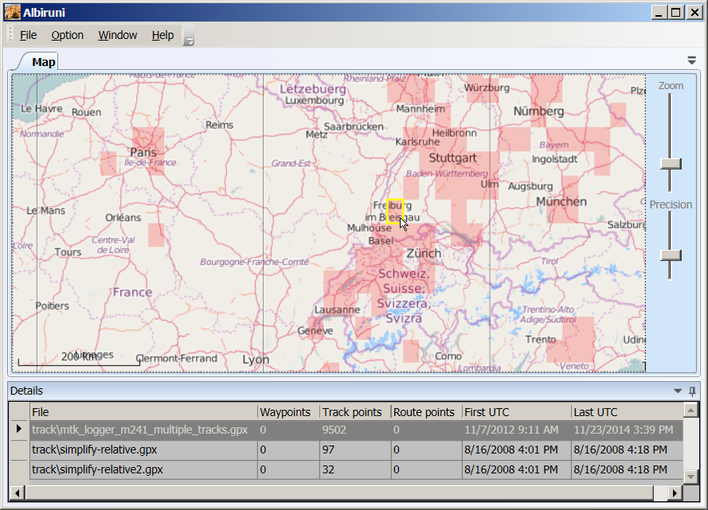

# Albiruni

Windows desktop software to map large sets of GPS data, such as tracks and waypoints, in an efficient summarized style, rarely found in other open source software.    Painting it with subtle-colored polygons rather than solid lines and icons, the map and essential facts are readable, even as scale is zoomed, no matter the quantity of data.   It currently reads all **gpx** and geotagged **jpg** files in/under a folder.

Named after the medieval Persian scientist [Abū Rayḥān Muḥammad ibn Aḥmad Al-Bīrūnī](https://en.wikipedia.org/wiki/Al-Biruni).  Almost 1000 years ago, he accurately measured the Earth and tabulated coordinates of hundreds of locations.

Builds with Visual Studio 2013 and targets .NET Framework 4.5 in Windows.

Release scheduled for Summer 2016.  Albiruni's code is under [GNU Public License](./LICENSE).

## Sample

Mouse on a cell to display detail about source files.  Note yellow rectangle near center.

[From gpsbabel gpx examples.](https://github.com/gpsbabel/gpsbabel/tree/master/reference)

## Practical applications for visualization

- personal travel records
 - macroscopic view
 - finding detail buried in many files
- drone flight logs
 - geotagged photos, videos
- scientific research
- business
 - sales, real estate
 - agriculture/forestry
 - energy utilities and exploration
 - aviation
- government, regulatory
 - disaster, search, rescue
 - disease control
 - law enforcement
 - criminal investigation
 - miltary, defense
- black boxes, event data recorders, smartphones
- political campaigns

Some of these domains would require minor straightforward implementation.  Anything is possible, given a source of sample data, or file, and a documented specification/standard, better yet already coded in C#.    

OpenStreetMaps are displayed, as they are free.   Some popular alternative maps require licensing, yet they are feasible for a derivative work. 

## Ideas on the drawing board

New kinds of data emerge with new technology, leading to endless possible features for Albiruni.

The display may vary with dimensions of interest, such as date/time or any given property of the spatial points.  Color, shade, and hiding/filtering will help answer questions about these variables.  Users may want to know:
- All regions covered in a range of dates
- Dates when a region of interest was covered
- Regions that were never covered in a period
- Correlations/intersections between multiple specific tracks, or between a GPS track and other date/location information

Albiruni would bridge gaps in other applications.  After you seek answers and find/create a file, open the file in a [preferred application](./Documents/OtherApplications.md).   It will be useful to select waypoints or tracks, combining different or redundant data from several original files, and save a new file for use in a GPS.

## Acknowledgments

Gold medal contributions to open source mapping:

- [XAML Map Control](http://xamlmapcontrol.codeplex.com)
- [Geospatial Library](https://github.com/sibartlett/Geo.git)
- [gpsbabel](https://github.com/gpsbabel/gpsbabel)

Strongly appreciated:

- Extended WPF Toolkit Community Edition
- photo exif
- Prism for WPF
- Fody PropertyChanged
- WPFFolderBrowser
- WpfScreenHelper
